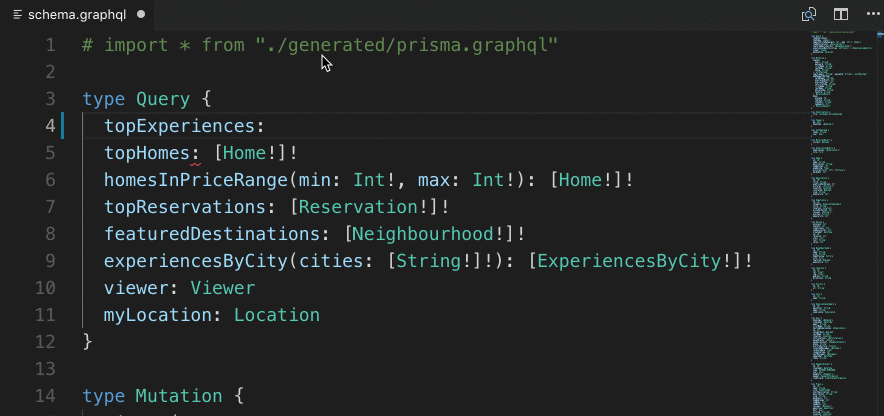
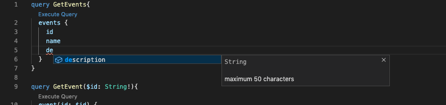
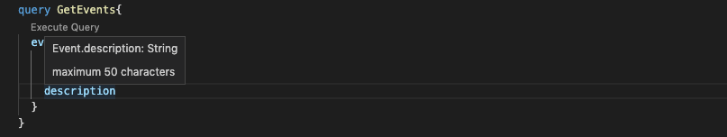
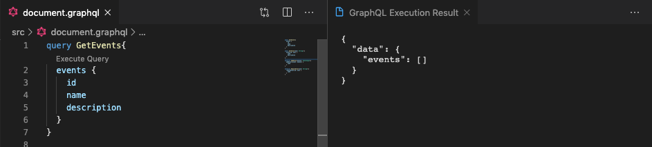
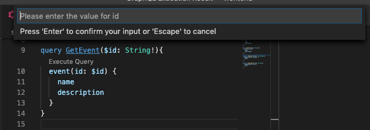
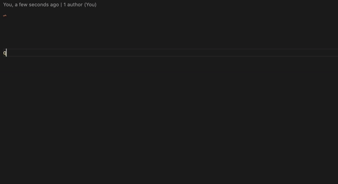
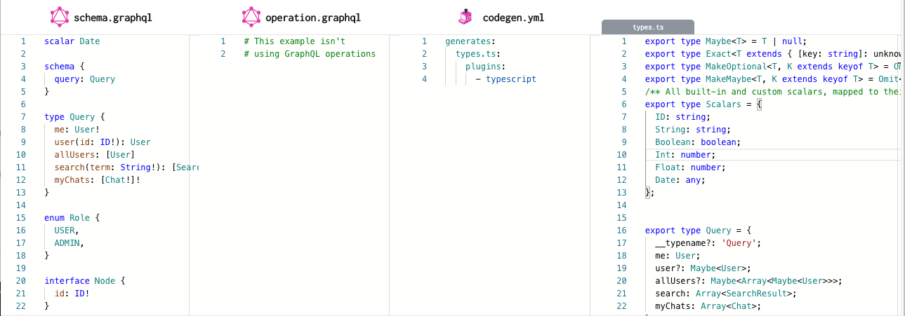
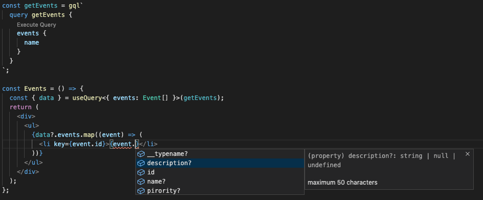
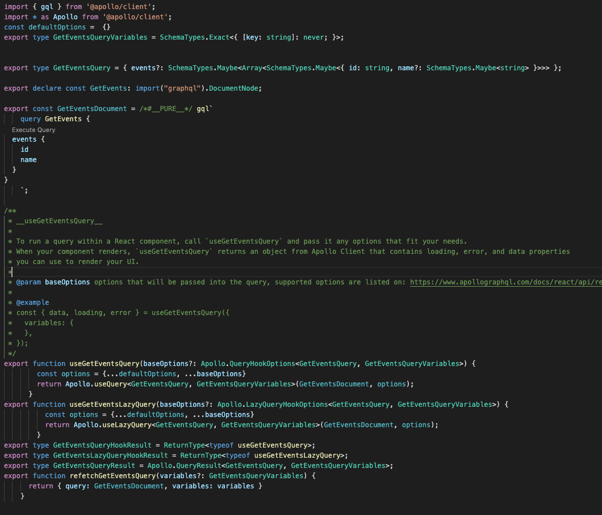

# GraphQL + Apollo Client (React) + Typescript

## 前言

社区里已有很多有关 GraphQL 入门和原理的文章，GraphQL 和 Apollo Client 的官方网站也有较为详细的介绍。相对于 REST, 社区也从各个方面分析了 GraphQLQL 的优劣利弊。本文主要是从前端的角度出发，在如今前后端开发分离盛行的前提下，分享一些我们如何利用社区中热门的工具提高开发效率和工程质量的经验，希望对已经决心入坑 GraphQL 的朋友们有一些帮助。

## GraphQL Playground

第一次接触 GraphGL 的时候一定会从官方文档里了解到 GraphQL Server 所提供的 [Playground](https://github.com/GraphQL/GraphQL-playground). 

Playground 是一个完整的浏览器端 GraphQL IDE, 包括 Documentation , Schema 和一个可以编写和测试GraphGL请求的编辑器。


对于使用 GraphQL 的开发团队, Playground 基本可以代替如 Swagger 之类的的 api 文档和如 Postman 之类的的请求模拟工具。是一个较完备的开发手册，并且有点是0成本使用, 并且有团队在维护和迭代。 GraphQL 社区绝大多数对于GraphQL Server的实现都会内置 Playground。


## Apollo Client Devtool


[Apollo Client Devtool](https://chrome.google.com/webstore/detail/apollo-client-devtools/jdkknkkbebbapilgoeccciglkfbmbnfm) 是 Apollo Client 提供的一款Chrome插件，可以在浏览器的 console 中捕捉页面发送的query和mutation，并且提供了编辑，修改和重试这些请求，还有最重要的查看 GraphQL Client 缓存的功能。

因为所有的 GraphQL 都是发送给统一的路径，query body也是以字符串的形式发送，使得请求的可读性很差, Apollo Client Devtool 相较于通过传统 Networks 的方式做了优化。

以上两个工具可以说是入门必备，类似我们前后端对接 Restful Api 时我们会用到的工具。GraphQL 依赖 Schema 提供了更多的提效工具。

## GrahpQL VSCode Plugin



VScode Plugin [GraphQL](https://marketplace.visualstudio.com/items?itemName=GraphQL.vscode-GraphQL) 提供了相当齐全的功能，包括语法检查，语法高亮，引用跳转，Schema悬浮提示，autocomplete等。是一个必装的插件。

很重要的一个功能是，当我们在定义Schema的时候对每一个参数所定义的描述（有的实现是通过代码注释的方式插入Schema）是可以通过这个插件的提示在IDE里展示的，也就是原本前后两端都需要的注释内容，包括对接口的描述，对接口参数的描述等， 现在在可以只用在Schema里定义一遍就可以了。





该Plugin还提供了一个可以在IDE内执行query和mutation的功能。



但是个人认为实用性有限，对于不含参数的query查询可以直接执行，对于需要传入参数的query和mutation需要在vscode的弹窗中输入参数，如果是较为简单的字符串或者数字参数比较方便，但是如果是较为复杂的结构体就需要输入stringfy过后的JSON格式，并且很多情况下链式请求的参数依赖上一个请求，发送请求所需的参数就更不容易手动获取了。



以上工具可以帮助我们更方便的查询和编写 query, 但只有这些功能还是远远不够的，我们需要借助工具将 Schema 融入前端工程化的过程，提效的同时提高代码的健壮性。

## GraphQL Eslint



[GraphQL Eslint](https://github.com/dotansimha/GraphQL-Eslint) 最基础的前端代码检查就是Eslint，我们有了统一的 Schema 之后, 就可以通过 Schema 生成的对应的规则来对 query 进行 类似Playground 中 Syntax 检查. 

## GraphQL Code Generator 

[GraphQL Code-Generator ](https://www.GraphQL-code-generator.com/) 最能提高前端代码健壮性的方法无疑是 typescript , 但是根据 Schema 手写项目全套的类型文件会有很大的工作量， GraphQL Code Generator 是一个根据 Schema 生成各类语言类型文件的 cli 工具, 工具本身是通过preset和plugin的方式来实现针对不同语言和功能的需求，官方本身也提供了很丰富的 preset 和 plugin 可以满足大部分的开发需求，自定义  plugin 也有较为详细的文档和示例。这里我们只讨论 typescript 和相关的 plugin.



最核心的一点是通过code generator生成的type文件是包含Schema描述的。所以我们在使用 GraphQL 返回的数据时，typescript是会提示数据类型的描述的。如下图，关于 event 对象中 description字段的描述“maximum 50 characters” 是后端在定义 Schema 时写的注释，通过这个生成的类型文件，成为了前端typescript 类型文件中的注释，可以被IDE完美引用。等于说后端同学在写代码注释时，也在帮前端同学写代码注释。



下面就是我们该如何使用这些类型文件的问题，以在VSCode Typescript插件的帮助下我们在使用 `useQuery` hook时，定义好 `useQuery`的伪类 就可以在使用返回数据时拥有完整的数据类型提醒，autocomplete和定义Schema时对字段的具体描述。这种方式在开发体验和效率上相比传统在项目和文档间来回切换提高了很多，也同时增强了代码的健壮性。

但是这种方式也存在一个问题，就是细心的朋友可能发现我们在定义query的时候只请求了events对象的name属性，但是自动提示却提示了events包含的所有可能字段，并不能完全满足我们的要求。

我们看一下`useQuery`方法的类型定义:

```ts
useQuery<TData = any, TVariables = OperationVariables>(query: DocumentNode | TypedDocumentNode<TData, TVariables>, options?: QueryHookOptions<TData, TVariables>): QueryResult<TData, TVariables>;
```

接受两个伪类 `TData` 和 `TVaraibles`，我们需要在使用hooks的时候传入这两个参数如果要根据query来自定义返回值我们可能需要在第一个参数传入类似被使用Pick, Exclude包装过后的类型，如果query或mutation有传入参数也需要从根路径的type.ts去引用Input的类型，非常的麻烦。

```ts
  { events: Pick<Event, 'name'>[] }
```


```GraphQL
query GetEvents{
  events {
    id
    name
  }
}
```

code-generator 针对这个问题也有相应的方案，通过 `typescript-operations` 这个 plugin 生成的文件生成的类型文件会自动排除缺省的字段.

```ts
export type GetEventsQueryVariables = SchemaTypes.Exact<{ [key: string]: never; }>;

// With Pick 
export type GetEventsQuery = { events?: SchemaTypes.Maybe<Array<SchemaTypes.Maybe<Pick<SchemaTypes.Event, 'id' | 'name'>>>> };

// Without Pick
export type GetEventsQuery = { events?: SchemaTypes.Maybe<Array<SchemaTypes.Maybe<{ id: string, name?: SchemaTypes.Maybe<string> }>>> };

```

对于使用 React + Apollo Client 的项目，`typescript-react-apollo` plugin 不仅可以生成类型，还可以可以生成和query相对应的请求的hook 包括封装好的useQuery, useLazyQuery等，可以在保证代码类型完整的前提下极大的提高开发效率。



Code generator的插件很多，配置项也很多，自定义 plugin 也比较容易，可以根据根据项目需要，配置出适合项目适合团队的工程化方案。

## GraphQL Introspection 

以上提到的所有工具都是依靠 GraphQL 标准中提供的 Introspection 接口实现的，该接口的能力其实也很简单明了，就是规定了对于GraphQL请求的根部永远是__schema节点，可以通过这个节点来查询整个Schema的内容。 社区里的绝大部分工具也都是通过这个接口的能力开发。

[Introspection](https://GraphQL.org/learn/introspection/), 感兴趣的朋友也可以参考GraphQL的官方文档去开发适合自己的工具。

## GraphQL Config

最后要提的是 [GraphQL Config](https://GraphQL-config.com/introduction), 一份配置文件支持所有和GraphQL相关的工具。该配置文件支持多种文件类型，例如json, yaml, yml, js, ts等等，社区里大部分工具都已支持GraphQL config配置文件，GraphQL官方也建议开发者使用GraphQL config来作为配置文件。如果开发自己的工具也可以使用graphql config作为配置文件。我们在使用和分享 GraphQL 生态中的这些工具时，只依赖一份配置文件是非常方便的。

```
schema: './schema/*.GraphQL'
extensions:
  codegen:
    generates:
      ./src/types.ts:
        plugins:
          - typescript
          - typescript-resolvers
```